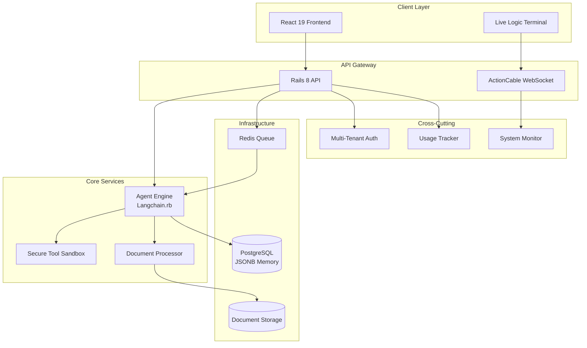
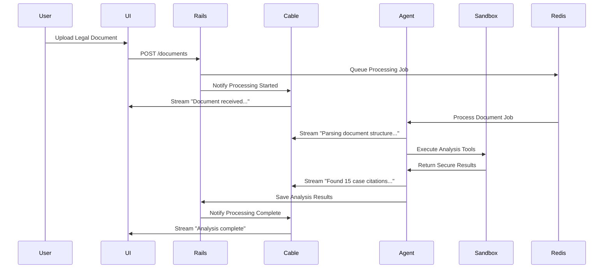

# Design Document: LegaStream AI Agentic OS

## Overview

LegaStream is a Vertical AI Agentic Operating System specifically designed for legal discovery workflows. The system combines autonomous document processing, real-time transparency, and enterprise-grade security to serve mid-sized law firms and independent legal researchers. 

The architecture centers around three core innovations:
1. **Autonomous Agent Engine** - Powered by Langchain.rb for intelligent document analysis
2. **Live Logic Terminal** - Real-time WebSocket streaming of agent reasoning processes  
3. **Secure Tool Sandbox** - Isolated execution environment preventing sensitive data exposure

The system processes 500+ page legal documents while maintaining complete data isolation between law firm tenants and providing transparent usage-based billing.

## Architecture

### High-Level System Architecture



### Component Interaction Flow



## Components and Interfaces

### 1. Agent Engine (Langchain.rb)

**Purpose**: Autonomous reasoning and decision-making for legal document analysis

**Key Responsibilities**:
- Document parsing and entity extraction
- Legal precedent research and analysis
- Chain-of-thought reasoning generation
- Context maintenance across sessions

**Interface Design**:
```ruby
class AgentEngine
  def initialize(tenant_id:, sandbox:)
    @tenant_id = tenant_id
    @sandbox = sandbox
    @chain = build_langchain_agent
  end
  
  def process_document(document_path, callback: nil)
    # Returns analysis results while streaming thoughts
  end
  
  def analyze_compliance(document, regulations)
    # Returns compliance analysis with flagged clauses
  end
  
  private
  
  def build_langchain_agent
    # Langchain.rb agent configuration
  end
end
```

**Integration Points**:
- Receives jobs from Redis queue
- Executes tools within Secure Sandbox
- Streams reasoning to Live Logic Terminal
- Stores context in PostgreSQL JSONB

### 2. Live Logic Terminal

**Purpose**: Real-time streaming interface showing agent reasoning processes

**Key Responsibilities**:
- WebSocket connection management
- Chain-of-thought message formatting
- Session isolation per user
- Connection resilience and reconnection

**Interface Design**:
```ruby
class LogicTerminalChannel < ApplicationCable::Channel
  def subscribed
    stream_for current_user_session
  end
  
  def stream_thought(message, context = {})
    broadcast_to current_user_session, {
      type: 'reasoning_step',
      message: message,
      timestamp: Time.current,
      context: context
    }
  end
end
```

**Message Types**:
- `reasoning_step`: Agent thought processes
- `tool_execution`: Sandbox tool usage
- `progress_update`: Processing status
- `error_notification`: Error conditions
- `completion_summary`: Final results

### 3. Secure Tool Sandbox

**Purpose**: Isolated execution environment for sensitive legal data processing

**Key Responsibilities**:
- Secure tool execution without external API exposure
- Data encryption at rest and in transit
- Audit logging for compliance
- Resource isolation between tenants

**Interface Design**:
```ruby
class SecureToolSandbox
  def initialize(tenant_id:)
    @tenant_id = tenant_id
    @encryption_key = tenant_encryption_key
  end
  
  def execute_search(query, document_set)
    # Secure search within tenant boundaries
  end
  
  def extract_entities(text)
    # Local NLP processing without external calls
  end
  
  def calculate_compliance_score(document, regulations)
    # Secure compliance analysis
  end
end
```

**Security Features**:
- Process isolation using containers
- Encrypted data storage with tenant-specific keys
- Network isolation preventing external data leakage
- Comprehensive audit logging

### 4. Document Processor

**Purpose**: High-performance parsing and indexing of large legal documents

**Key Responsibilities**:
- PDF/DOCX/TXT parsing and text extraction
- Legal entity recognition and indexing
- Document structure analysis
- Metadata extraction and storage

**Interface Design**:
```ruby
class DocumentProcessor
  def process(file_path, tenant_id:)
    # Returns structured document data
  end
  
  def extract_entities(text)
    # Returns legal entities (cases, statutes, parties)
  end
  
  def create_searchable_index(document)
    # Creates full-text search index
  end
end
```

### 5. Multi-Tenant Authentication & Authorization

**Purpose**: Secure tenant isolation and user management

**Key Responsibilities**:
- Tenant-based data isolation
- Role-based access control
- Session management
- API authentication

**Interface Design**:
```ruby
class TenantContext
  def self.current
    # Returns current tenant context
  end
  
  def self.switch(tenant_id)
    # Switches tenant context for request
  end
end

class AuthorizationService
  def can_access_document?(user, document)
    # Tenant-based document access control
  end
end
```

### 6. Usage Tracking & Billing

**Purpose**: Accurate token consumption tracking and billing calculation

**Key Responsibilities**:
- Real-time token usage monitoring
- Per-tenant usage aggregation
- Billing calculation and reporting
- Usage limit enforcement

**Interface Design**:
```ruby
class UsageTracker
  def track_tokens(tenant_id:, user_id:, operation:, token_count:)
    # Records token usage with context
  end
  
  def calculate_monthly_bill(tenant_id, month)
    # Returns detailed billing breakdown
  end
  
  def check_usage_limits(tenant_id)
    # Returns usage status and limits
  end
end
```

## Data Models

### Core Data Structures

```ruby
# Document Model
class Document
  # Fields: id, tenant_id, filename, file_path, status, metadata
  # JSONB: extracted_entities, analysis_results, processing_log
end

# Agent Memory Model  
class AgentMemory
  # Fields: id, tenant_id, session_id, context_type
  # JSONB: conversation_history, learned_patterns, document_context
end

# Usage Record Model
class UsageRecord
  # Fields: id, tenant_id, user_id, operation_type, token_count, timestamp
  # JSONB: operation_details, billing_metadata
end

# Tenant Model
class Tenant
  # Fields: id, name, subscription_tier, encryption_key_id
  # JSONB: configuration, billing_settings, compliance_requirements
end
```

### Database Schema Design

```sql
-- Documents table with JSONB for flexible metadata
CREATE TABLE documents (
  id BIGSERIAL PRIMARY KEY,
  tenant_id BIGINT NOT NULL,
  filename VARCHAR(255) NOT NULL,
  file_path TEXT NOT NULL,
  status VARCHAR(50) DEFAULT 'pending',
  metadata JSONB DEFAULT '{}',
  extracted_entities JSONB DEFAULT '{}',
  analysis_results JSONB DEFAULT '{}',
  processing_log JSONB DEFAULT '[]',
  created_at TIMESTAMP DEFAULT NOW(),
  updated_at TIMESTAMP DEFAULT NOW()
);

-- Agent memory with JSONB for conversation context
CREATE TABLE agent_memories (
  id BIGSERIAL PRIMARY KEY,
  tenant_id BIGINT NOT NULL,
  session_id VARCHAR(255) NOT NULL,
  context_type VARCHAR(100) NOT NULL,
  conversation_history JSONB DEFAULT '[]',
  learned_patterns JSONB DEFAULT '{}',
  document_context JSONB DEFAULT '{}',
  created_at TIMESTAMP DEFAULT NOW(),
  updated_at TIMESTAMP DEFAULT NOW()
);

-- Usage tracking for billing
CREATE TABLE usage_records (
  id BIGSERIAL PRIMARY KEY,
  tenant_id BIGINT NOT NULL,
  user_id BIGINT NOT NULL,
  operation_type VARCHAR(100) NOT NULL,
  token_count INTEGER NOT NULL,
  operation_details JSONB DEFAULT '{}',
  billing_metadata JSONB DEFAULT '{}',
  created_at TIMESTAMP DEFAULT NOW()
);
```

### JSONB Usage Patterns

**Document Metadata Example**:
```json
{
  "extracted_entities": {
    "case_citations": ["Brown v. Board, 347 U.S. 483"],
    "statutes": ["42 U.S.C. § 1983"],
    "parties": ["Plaintiff Corp", "Defendant LLC"],
    "dates": ["2024-01-15", "2023-12-01"]
  },
  "analysis_results": {
    "compliance_score": 0.85,
    "flagged_clauses": [
      {
        "clause": "4.2",
        "issue": "Potential GDPR violation",
        "confidence": 0.92
      }
    ]
  }
}
```

**Agent Memory Example**:
```json
{
  "conversation_history": [
    {
      "timestamp": "2024-02-04T10:30:00Z",
      "type": "reasoning_step",
      "content": "Analyzing contract clause 4.2 for compliance issues..."
    }
  ],
  "learned_patterns": {
    "common_compliance_issues": ["data_retention", "consent_management"],
    "document_types_seen": ["employment_contract", "privacy_policy"]
  }
}
```

## Correctness Properties

*A property is a characteristic or behavior that should hold true across all valid executions of a system—essentially, a formal statement about what the system should do. Properties serve as the bridge between human-readable specifications and machine-verifiable correctness guarantees.*

After analyzing the acceptance criteria, I've identified the following properties that can be validated through property-based testing. Some properties have been consolidated to eliminate redundancy while maintaining comprehensive coverage.

### Property 1: Document Processing Performance
*For any* valid PDF document up to 500+ pages, processing and indexing should complete within 5 minutes regardless of document complexity or content structure.
**Validates: Requirements 1.1**

### Property 2: Entity Extraction Accuracy
*For any* legal document containing known entities (case citations, statutes, parties, dates), the extraction accuracy should meet or exceed 95% across all document types and formats.
**Validates: Requirements 1.2**

### Property 3: Error Handling Completeness
*For any* document processing failure scenario, the system should provide detailed error messages and implement retry mechanisms without data loss.
**Validates: Requirements 1.3**

### Property 4: Format Support Universality
*For any* document in supported formats (PDF, DOCX, TXT), the Document_Processor should successfully parse and process the content regardless of file size or complexity.
**Validates: Requirements 1.4**

### Property 5: Sandbox Security Enforcement
*For any* document containing sensitive information, all processing operations should execute within the Secure_Tool_Sandbox with no external data leakage.
**Validates: Requirements 1.5, 4.1, 4.2**

### Property 6: Real-Time Streaming Consistency
*For any* agent processing session, the Live_Logic_Terminal should stream Chain_of_Thought messages via WebSocket with contextual information and proper formatting.
**Validates: Requirements 2.1, 2.2**

### Property 7: Session Isolation Guarantee
*For any* multi-user scenario accessing the same case, each user should receive completely isolated terminal sessions with no cross-contamination of data or messages.
**Validates: Requirements 2.3**

### Property 8: Connection Durability
*For any* terminal session lasting up to 4 hours, the WebSocket connection should remain stable, and any connection drops should trigger automatic reconnection with proper state recovery.
**Validates: Requirements 2.4, 2.5**

### Property 9: Agent Framework Integration
*For any* autonomous decision-making operation, the Agent_Engine should utilize Langchain.rb framework components and maintain context across multiple document analysis sessions.
**Validates: Requirements 3.1, 3.4**

### Property 10: Legal Analysis Completeness
*For any* legal document analysis, the Agent_Engine should identify relevant case law precedents and flag compliance issues with specific clause references and reasoning.
**Validates: Requirements 3.2, 3.3**

### Property 11: Human-in-the-Loop Activation
*For any* ambiguous legal language encountered during processing, the system should request human clarification rather than making uncertain automated decisions.
**Validates: Requirements 3.5**

### Property 12: Audit Logging Completeness
*For any* data access operation within the Secure_Tool_Sandbox, all attempts should be logged with complete audit trails for compliance verification.
**Validates: Requirements 4.3**

### Property 13: Encryption Coverage
*For any* client data operation, encryption should be applied both at rest and in transit throughout the entire data lifecycle within the system.
**Validates: Requirements 4.5**

### Property 14: Tenant Data Isolation
*For any* multi-tenant scenario, complete data isolation should be maintained between different law firm tenants with no cross-tenant data visibility.
**Validates: Requirements 5.1, 5.2**

### Property 15: Administrative Control Completeness
*For any* user access or permission management operation, firm administrators should be able to control and modify access rights through the Multi_Tenant_Dashboard.
**Validates: Requirements 5.3**

### Property 16: Tenant Provisioning Performance
*For any* new law firm onboarding, isolated environments should be provisioned within 15 minutes while supporting up to 100 concurrent tenants.
**Validates: Requirements 5.4, 5.5**

### Property 17: Usage Tracking Accuracy
*For any* AI token consumption operation, the Usage_Tracker should monitor and record consumption with 99.9% accuracy across all client organizations.
**Validates: Requirements 6.1, 6.5**

### Property 18: Billing Calculation Correctness
*For any* monthly billing period, the system should generate detailed usage breakdowns by user and document with support for multiple pricing tiers based on volume.
**Validates: Requirements 6.2, 6.3**

### Property 19: Usage Limit Enforcement
*For any* scenario where usage exceeds predefined limits, the system should notify administrators and implement throttling mechanisms as configured.
**Validates: Requirements 6.4**

### Property 20: WebSocket Infrastructure Reliability
*For any* real-time communication scenario, ActionCable WebSocket connections should support up to 500 concurrent connections with immediate status notifications and automatic reconnection with exponential backoff.
**Validates: Requirements 7.1, 7.2, 7.3, 7.4**

### Property 21: Message Delivery Guarantees
*For any* critical notification, the Real_Time_System should maintain delivery guarantees ensuring important messages reach their intended recipients.
**Validates: Requirements 7.5**

### Property 22: Memory Storage and Retrieval Performance
*For any* agent memory operation, conversation context and learned patterns should be stored in PostgreSQL JSONB format with retrieval times under 100ms.
**Validates: Requirements 8.1, 8.2**

### Property 23: Memory Lifecycle Management
*For any* stored session data, automatic cleanup should occur after 90 days, with archival to cold storage when capacity limits are reached, while maintaining full-text search capabilities.
**Validates: Requirements 8.3, 8.4, 8.5**

### Property 24: Background Job Processing Reliability
*For any* background processing operation, Redis should handle job queuing asynchronously without UI blocking, with prioritization based on client tier and retry logic with exponential backoff up to 3 attempts.
**Validates: Requirements 9.1, 9.2, 9.3, 9.4**

### Property 25: Job Status Integration
*For any* background job execution, real-time status updates should be provided to the Live_Logic_Terminal maintaining processing transparency.
**Validates: Requirements 9.5**

### Property 26: API Architecture Compliance
*For any* API operation, the Rails 8 API-only architecture should provide RESTful endpoints with JSON format, comprehensive error handling, and response times under 200ms for standard operations.
**Validates: Requirements 10.1, 10.2, 10.3**

### Property 27: API Rate Limiting and Documentation
*For any* API rate limit scenario, appropriate HTTP status codes and retry headers should be returned, with complete OpenAPI documentation available for all endpoints.
**Validates: Requirements 10.4, 10.5**

## Error Handling

### Error Classification System

**Critical Errors** (System Halt Required):
- Sandbox security breaches
- Tenant data isolation failures  
- Encryption key compromise
- Database corruption

**Recoverable Errors** (Retry with Backoff):
- Document processing failures
- WebSocket connection drops
- Background job failures
- External service timeouts

**User Errors** (Immediate Feedback):
- Invalid document formats
- Insufficient permissions
- Usage limit exceeded
- Malformed API requests

### Error Response Patterns

```ruby
# Standardized error response format
{
  "error": {
    "code": "DOCUMENT_PROCESSING_FAILED",
    "message": "Unable to process document due to corrupted PDF structure",
    "details": {
      "document_id": "doc_123",
      "tenant_id": "tenant_456", 
      "retry_after": 300,
      "support_reference": "ERR_2024_02_04_001"
    },
    "timestamp": "2024-02-04T10:30:00Z"
  }
}
```

### Recovery Mechanisms

**Automatic Recovery**:
- WebSocket reconnection with exponential backoff
- Background job retry with increasing delays
- Database connection pool recovery
- Memory cleanup and garbage collection

**Manual Recovery**:
- Administrator alerts for critical failures
- Tenant isolation breach notifications
- Security incident response procedures
- Data integrity verification tools

## Testing Strategy

### Dual Testing Approach

The system requires both unit testing and property-based testing to ensure comprehensive coverage:

**Unit Tests**: Verify specific examples, edge cases, and error conditions
- Integration points between components
- Specific error scenarios and edge cases  
- API endpoint behavior with known inputs
- Database schema and migration correctness

**Property Tests**: Verify universal properties across all inputs
- Document processing across various file types and sizes
- Tenant isolation across all multi-tenant scenarios
- Real-time streaming behavior across all session types
- Security enforcement across all data operations

### Property-Based Testing Configuration

**Framework Selection**: Use `rspec-quickcheck` for Ruby property-based testing
- Minimum 100 iterations per property test to ensure statistical confidence
- Each property test must reference its corresponding design document property
- Tag format: **Feature: legastream-ai-os, Property {number}: {property_text}**

**Test Data Generation**:
- Smart generators that constrain to realistic legal document inputs
- Multi-tenant test scenarios with proper data isolation
- WebSocket connection simulation with various failure modes
- Usage pattern generation for billing accuracy verification

**Example Property Test Structure**:
```ruby
RSpec.describe "Document Processing" do
  it "processes any valid PDF within time limits" do
    # Feature: legastream-ai-os, Property 1: Document Processing Performance
    property_of {
      pdf_document = generate_legal_pdf(pages: range(1, 500))
      [pdf_document]
    }.check { |document|
      start_time = Time.current
      result = DocumentProcessor.new.process(document)
      processing_time = Time.current - start_time
      
      expect(result).to be_successful
      expect(processing_time).to be < 5.minutes
    }
  end
end
```

### Integration Testing Strategy

**End-to-End Workflows**:
- Complete document upload and analysis workflows
- Multi-user real-time collaboration scenarios
- Tenant onboarding and provisioning processes
- Billing calculation and usage tracking accuracy

**Performance Testing**:
- Load testing with 500 concurrent WebSocket connections
- Document processing performance with maximum file sizes
- Database query performance with large datasets
- Memory usage patterns under sustained load

**Security Testing**:
- Tenant isolation verification across all data operations
- Sandbox security boundary testing
- Encryption verification for data at rest and in transit
- Audit log completeness and integrity verification

The testing strategy ensures that both specific functionality and universal system properties are thoroughly validated, providing confidence in the system's correctness and reliability for legal discovery workflows.